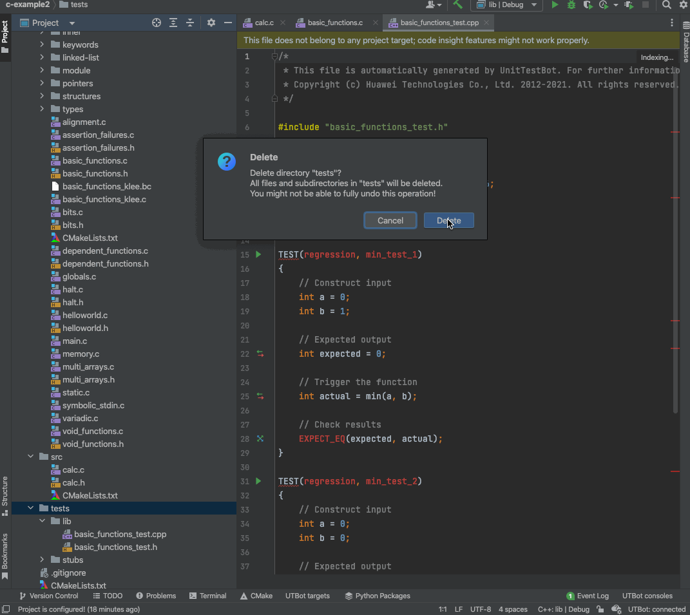
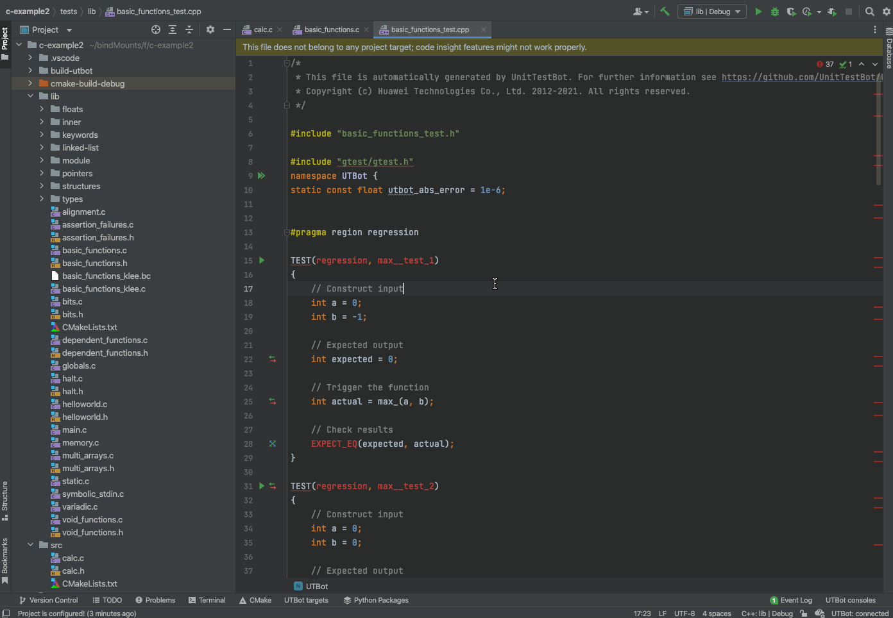
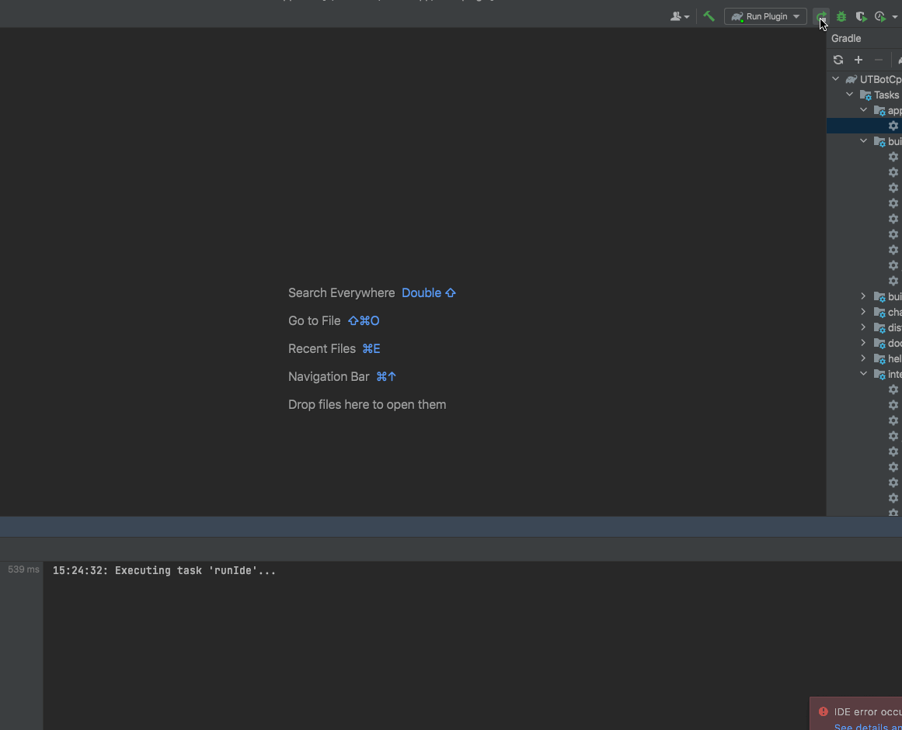
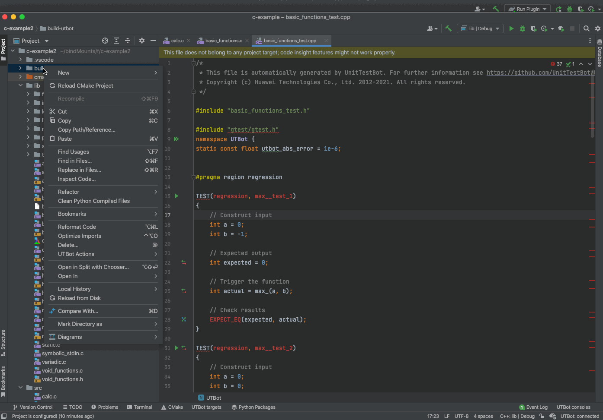

#Testcases
Some scenarios on plugin usage and expected behaviour.

### Project view should be updated after test generation

Scenario: Delete the test directory and request tests (e.g for file)

Expected: tests directory with tests should be generated

### Settings should be persisted

Scenario: change some field's value in `UTBot Settings` and press `ok`

Expected: the new value should be persisted, also when you restart 
the ide you see updated value

### Project configuration when opening project

Scenario: open a project in CLion

Expected: a request for project configuration should be sent, it 
can be checked in client logs.

### Project configuration when build folder is deleted

Scenario: delete the build folder utbot uses, than launch plugin.

Expected: a balloon should appear suggesting to generate build folder, than 
another balloon suggesting to generate json files.

### Generate for predicate should check 

Scenario: choose generate for predicate and enter the wrong value or too large value

t Expected: a warning should be shown 

